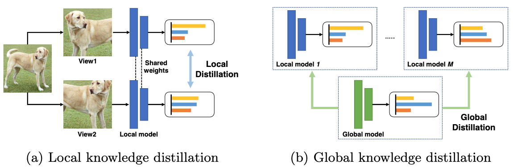
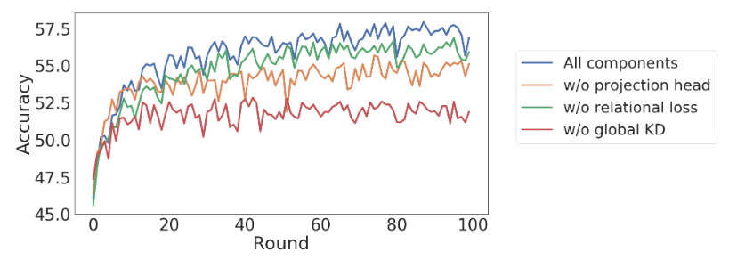
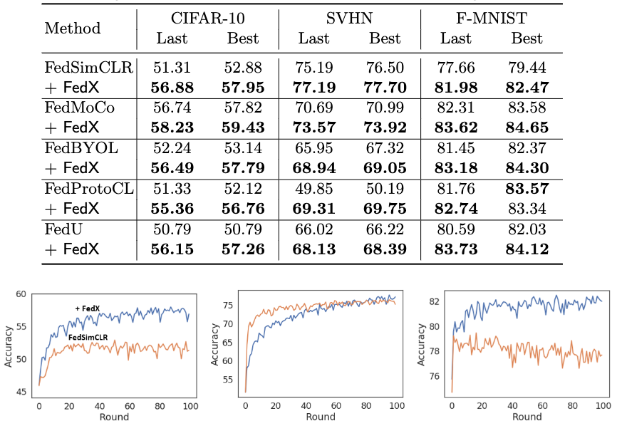
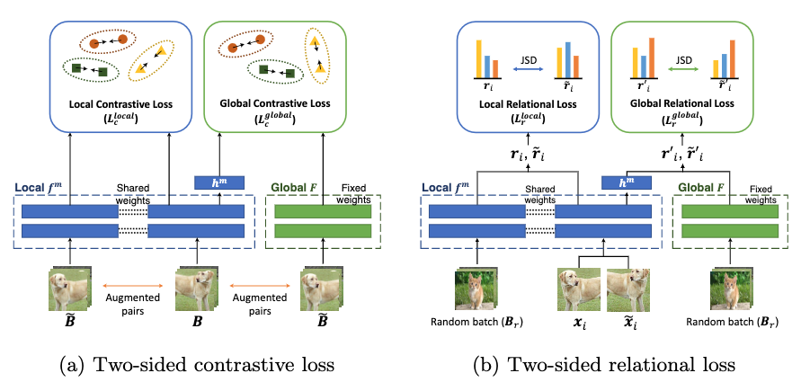

# FedX: Unsupervised Federated Learning with Cross Knowledge Distillation #
This repo is the PyTorch code for "FedX: Unsupervised Federated Learning with Cross Knowledge Distillation"

## Highlight ##
1. We propose an unsupervised federated learning algorithm, FedX, that learns data representations via a unique two-sided knowledge distillation at local and global levels.
  <p align="center"> </center>
  
2. Two-sided knowledge distillation helps discover meaningful representation from local data while eliminating bias by using global knowledge.
  <p align="center"> </center>
  
3. FedX can be applied to extant algorithms to enhance performance by 1.6∼5.5 pp in top-1 accuracy and further enhance training speed.
  <p align="center"> </center>


## Overall model architecture ##
<center> </center>

## Usage ##
```
usage: main.py [-h] [--model MODEL] [--dataset DATASET]
               [--net_config NET_CONFIG] [--partition PARTITION]
               [--batch-size BATCH_SIZE] [--lr LR] [--epochs EPOCHS]
               [--n_parties N_PARTIES] [--alg ALG] [--comm_round COMM_ROUND]
               [--init_seed INIT_SEED] [--datadir DATADIR] [--reg REG]
               [--logdir LOGDIR] [--modeldir MODELDIR] [--beta BETA]
               [--device DEVICE] [--log_file_name LOG_FILE_NAME]
               [--optimizer OPTIMIZER] [--out_dim OUT_DIM]
               [--temperature TEMPERATURE] [--tt TT] [--ts TS] [--mu MU]
               [--sample_fraction SAMPLE_FRACTION] [--save_model SAVE_MODEL]
               [--use_project_head USE_PROJECT_HEAD]

config for FedX

optional arguments:
  -h, --help            show this help message and exit
  --model MODEL         neural network used in training
  --dataset DATASET     dataset used for training
  --net_config NET_CONFIG
  --partition PARTITION
                        the data partitioning strategy
  --batch-size BATCH_SIZE
                        input batch size for training (default: 64)
  --lr LR               learning rate (default: 0.1)
  --epochs EPOCHS       number of local epochs
  --n_parties N_PARTIES
                        number of workers in a distributed cluster
  --comm_round COMM_ROUND
                        number of maximum communication roun
  --init_seed INIT_SEED
                        Random seed
  --datadir DATADIR     Data directory
  --reg REG             L2 regularization strength
  --logdir LOGDIR       Log directory path
  --modeldir MODELDIR   Model directory path
  --beta BETA           The parameter for the dirichlet distribution for data
                        partitioning
  --device DEVICE       The device to run the program
  --log_file_name LOG_FILE_NAME
                        The log file name
  --optimizer OPTIMIZER
                        the optimizer
  --out_dim OUT_DIM     the output dimension for the projection layer
  --temperature TEMPERATURE
                        the temperature parameter for contrastive loss
  --tt TT               the temperature parameter for js loss in teacher model
  --ts TS               the temperature parameter for js loss in student model
  --sample_fraction SAMPLE_FRACTION
                        how many clients are sampled in each round
```


## To run the code ##
CIFAR-10 experiments with 10 local clients
```
python main.py --dataset cifar10 --batch-size 128 --n_parties 10 --logdir {path} --modeldir {path}
```


## Citation ##
If you find this repo useful for your research, please consider citing our paper:

```
@article{han2022fedx,
  title={FedX: Unsupervised Federated Learning with Cross Knowledge Distillation},
  author={Han, Sungwon and Park, Sungwon and Wu, Fangzhao and Kim, Sundong and Wu, Chuhan and Xie, Xing and Cha, Meeyoung},
  journal={arXiv preprint arXiv:2207.09158},
  year={2022}
}
```
